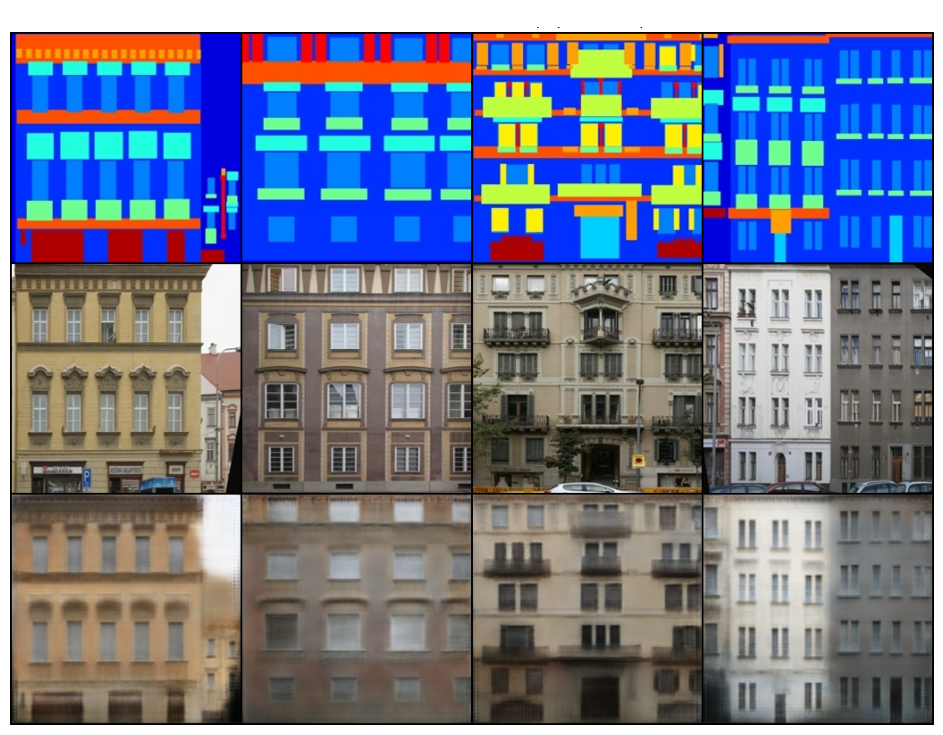
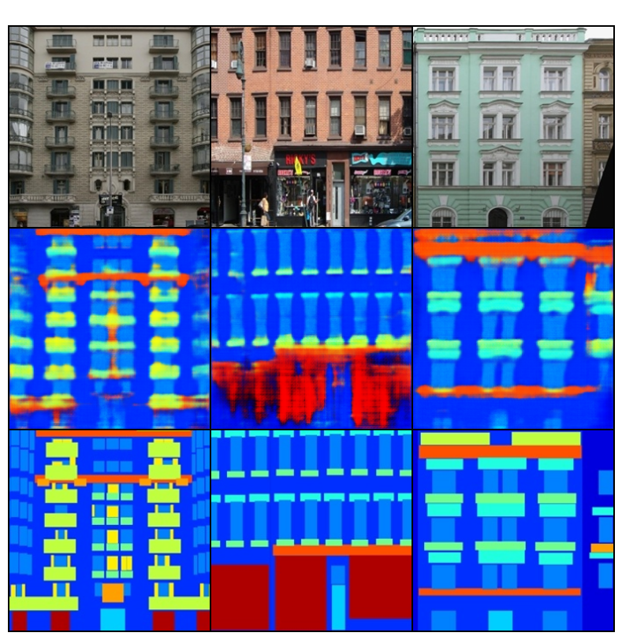

# Pix2Pix from Scratch – Google Colab Implementation

A clean from-scratch implementation of the famous **Pix2Pix** (Image-to-Image Translation with Conditional Adversarial Networks, 2016) entirely in Google Colab.

This project demonstrates:
- Reconstruction of the core Pix2Pix architecture
- U-Net generator with skip connections + PatchGAN discriminator
- Bidirectional training on the classic **facades** dataset:
  - **Forward**: semantic label maps → realistic building photos
  - **Reverse**: real photographs → semantic label maps (many-to-one challenge)

## Highlights

- Complete disassembly of key components into individual Colab cells with detailed Markdown explanations
- Real-time training debugging:
  - Loss printing every 50–100 iterations
  - Generated image grids every 200–400 steps
  - Learning rate monitoring
  - Periodic checkpoint saving
- Visual exploration of U-Net skip connections and feature maps

## Results

- Forward: label maps → realistic building photos
  - 
- Reverse: realistic building photos → label maps
  - 

## How to Use

1. Open the notebook in Google Colab  
   

2. Select GPU runtime (T4 recommended)

3. Run all cells sequentially

   → Dataset auto-downloads  
   → Forward model trains first  
   → Reverse direction training follows

## Key Technologies

- PyTorch
- U-Net architecture with skip connections
- PatchGAN discriminator
- LSGAN + L1 loss (λ=100)
- Learning rate linear decay

## Why This Project?

It shows how the same architecture can be surprisingly reversible — turning a many-to-one problem (photo → label) into a solvable task with proper conditioning and skip connections. Great for learning conditional GANs, U-Net design, and adversarial training in practice.

## Credits

Based on the original Pix2Pix paper by Isola et al. (2016) and inspired by the [official pytorch-CycleGAN-and-pix2pix repository](https://github.com/junyanz/pytorch-CycleGAN-and-pix2pix).

Dataset: [pix2pix Facades](https://www.kaggle.com/datasets/sabahesaraki/pix2pix-facades-dataset)